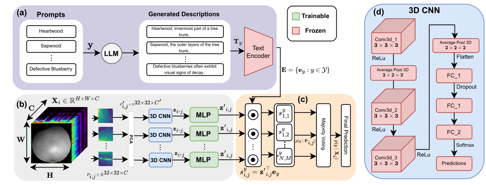

# Label Semantics for Robust Hyperspectral Image Classification

This repository contains code and resources from our IJCNN 2025 paper **"Label Semantics for Robust Hyperspectral Image Classification"**, with detailed implementation for the **HyperspectralBlueberries** dataset using the proposed **S3FN** (Semantic Spectral-
Spatial Fusion Network) framework and baselines.

---

## Overview

Hyperspectral image (HSI) classification often suffers in generalization performance when limited training data are present. Traditional models rely solely on spectral and spatial features, often ignoring the semantic structure of class labels.

In this work, we propose S3FN (Semantics-Supervised Spectral Feature Network), a novel two-stage framework that augments spectral-spatial representations with high-level semantic information. We leverage label descriptions generated using large language models (LLMs) and embed them using pretrained transformers (e.g., RoBERTa). These embeddings are then used guide the learning of robust spectral features.

The key contributions include:

A two-stage pipeline integrating 3D-CNN feature extraction and label semantic alignment.

Use of LLM-generated label descriptions and transformer-based embeddings to infuse semantic meaning into the classification process.

Improved robustness, demonstrated on challenging HSI benchmarks datasets.

This repository provides full implementation for the Hyperspectral Blueberry dataset, including preprocessing, 3D-CNN training, semantic embedding, and the final S3FN classification.

---

## Repository Structure (Simplified for Blueberry Dataset)

```bash
HyperspectralBlueberries/
├── 3DCNN.ipynb                   # 3D CNN pretraining
├── Baseline_SM.ipynb            # Baseline training with spectral means
├── S3FN.ipynb                   # S3FN training and evaluation
├── Test_w_voting.ipynb          # Final evaluation with voting
├── dataset_preprocessing/
│   ├── Individual_spectral_means.ipynb
│   ├── merge_SM_npy.ipynb
│   ├── dataset_split.ipynb
│   ├── individual_cube_extraction.ipynb
│   ├── combine_cubes_npy.ipynb
│   ├── random_cube.ipynb
│   └── PCA.ipynb
├── embedding/
│   ├── GPT_prompt.ipynb
│   └── label_embeddings_roberta_bert.ipynb
└── extract_3DCNN_features.ipynb
```

---

## S3FN Architecture

 <sub>*Figure: Overall pipeline for S3FN. Refer to the paper for indepth explanation.*</sub>

---

## How to Run (HyperspectralBlueberries)

### Baseline Pipeline

1. **Extract Spectral Means**

   ```bash
   Run: dataset_preprocessing/Individual_spectral_means.ipynb
   ```

2. **Combine & Split Data**

   ```bash
   Run: dataset_preprocessing/merge_SM_npy.ipynb
   Run: dataset_preprocessing/dataset_split.ipynb
   ```

3. **Train Baseline Model**

   ```bash
   Run: Baseline_SM.ipynb
   ```

---

### S3FN Pipeline

#### Stage 1: Cube Preprocessing, PCA & 3D CNN Training

1. **Extract Individual Cubes**

   ```bash
   Run: dataset_preprocessing/individual_cube_extraction.ipynb
   ```

2. **Combine Cubes & Generate 32×32×C Random Cubes**

   ```bash
   Run: dataset_preprocessing/combine_cubes_npy.ipynb  
   Run: dataset_preprocessing/random_cube.ipynb
   ```

3. **Dimensionality Reduction**

   ```bash
   Run: dataset_preprocessing/PCA.ipynb
   ```

4. **Pretrain 3D CNN**

   ```bash
   Run: 3DCNN.ipynb
   ```

#### Stage 2: Semantic Embedding + Fusion

5. **Generate Label Descriptions (LLM)**

   ```bash
   Run: embedding/GPT_prompt.ipynb
   ```

6. **Embed Descriptions with Roberta/BERT**

   ```bash
   Run: embedding/label_embeddings_roberta_bert.ipynb
   ```

7. **Extract CNN Features**

   ```bash
   Run: extract_3DCNN_features.ipynb
   ```

8. **Train & Evaluate S3FN**

   ```bash
   Run: S3FN.ipynb  
   Run: Test_w_voting.ipynb
   ```

---

## Dependencies

Install Python dependencies with:

```bash
pip install -r requirements.txt
```

---

## Dataset References

This repository makes use of the following hyperspectral datasets:

###  HyperspectralBlueberries

* **Title**: *HyperspectralBlueberries: a dataset of hyperspectral reflectance images of normal and defective blueberries*  
* **Author**: Yuzhen Lu  
* **Year**: 2024  
* **DOI**: [10.5281/zenodo.11200576](https://doi.org/10.5281/zenodo.11200576)

---

###  Hyperspectral Wood (Sapwood & Heartwood)

* **Title**: *Hyperspectral images for wood recognition (sapwood and heartwood)*  
* **Author**: Roberto Confalonieri  
* **Year**: 2022  
* **DOI**: [10.17632/2SFW446FHT.2](https://doi.org/10.17632/2SFW446FHT.2)

---

###  DeepHS-Fruit (Avocado & Kiwi)

* **Title**: *Measuring the Ripeness of Fruit with Hyperspectral Imaging and Deep Learning*  
* **Authors**: Leon Amadeus Varga, Jan Makowski, Andreas Zell  
* **Conference**: IJCNN 2021  
* **DOI**: [10.1109/IJCNN52387.2021.9533728](https://doi.org/10.1109/IJCNN52387.2021.9533728)

---


## Citation

If you find this work useful, please cite our paper:

```bibtex
@inproceedings{S3FN,
  title     = {Label Semantics for Robust Hyperspectral Image Classification},
  author    = {Rafin Hassan and Zarin Roshni and Rafiqul Bari and Alimul Islam and Nabeel Mohammed and Moshiur Farazi and Shafin Rahman},
  booktitle = {Proceedings of the International Joint Conference on Neural Networks (IJCNN)},
  year      = {2025},
  institution = {North South University and University of Doha for Science and Technology}
}
```

## License

This project is licensed under the terms of the [MIT License](LICENSE).
